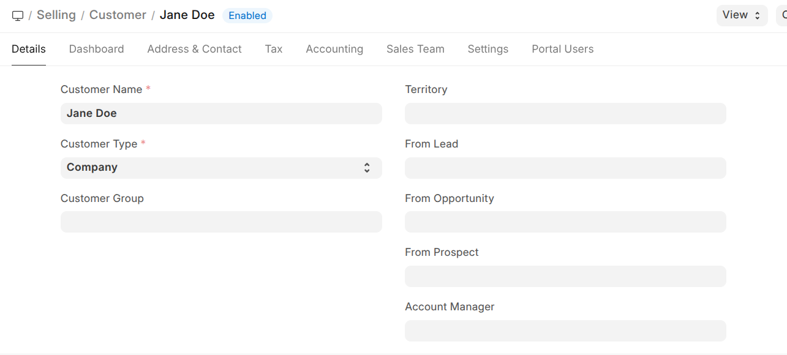
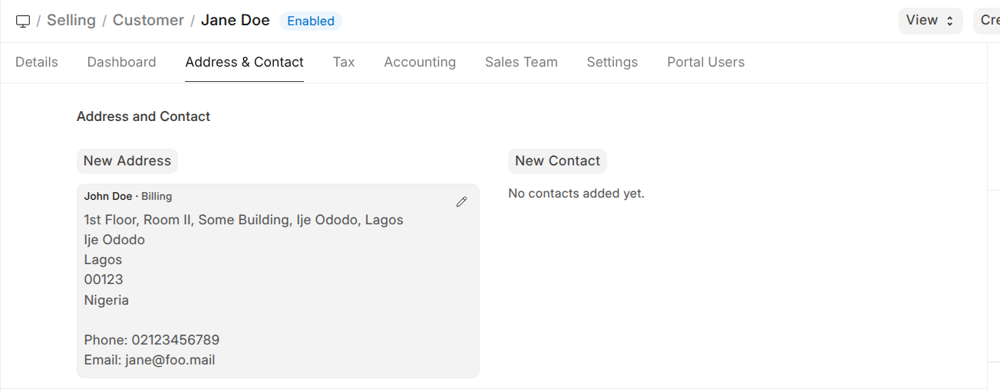
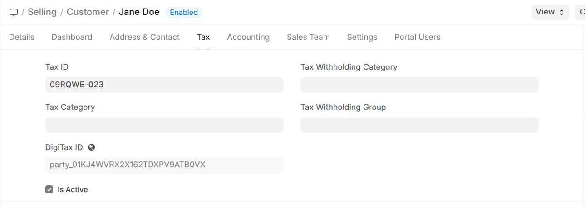
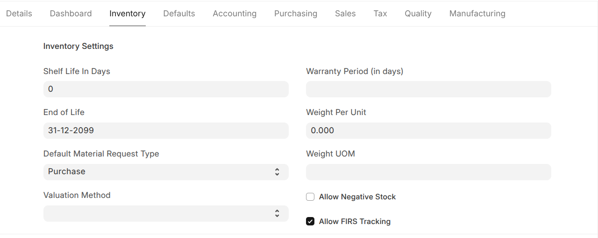

# Nigeria Compliance Via Digitax

Nigeria Revenue Service (NRS) integration via Digitax by Navari Ltd for Nigeria.

### [User Guide](https://docs.navari.co.ke/nigeria-compliance/introduction/nigeria-compliance)

### [Digitax API Specification](https://ng.docs.digitax.tech/reference/using-the-digitax-nigeria-api)

## Summary of Main Features

- **DigiTax integration for ERPNext/Frappe**
  Connects ERPNext transactions to the DigiTax Nigeria API for NRS-aligned invoicing and status synchronization.

- **Centralized NRS settings and environment configuration**
  Provides a dedicated **NRS Settings** DocType for company-level setup, including API key, base URL, environment, and sales-tracking controls.

- **Reference code management from DigiTax**
  Supports fetching and updating:
  - Invoice Type Codes
  - Tax Category Codes
  - Country Codes
  via NRS Settings buttons and backend utility endpoints, with create/update/unchanged stats in responses.

- **Automatic customer (party) sync**
  On customer updates, the app syncs party data to DigiTax using Tax ID and address details, then stores:
  - DigiTax party ID
  - Active status from DigiTax
  with validation and warning messages when required data is missing.

- **Automatic item sync for NRS-tracked items**
  On item updates, items marked **Allow NRS Tracking** are pushed to DigiTax and assigned a DigiTax item ID.
  The sync uses NRS tax/product categorization and protects against duplicate re-sync when an ID already exists.

- **Sales Invoice lifecycle integration**
  Adds invoice workflow automation:
  - Custom autonaming format for Sales Invoices
  - Validation of required DigiTax/NRS fields before submission
  - Submission to DigiTax on `before_submit` (standard invoice or credit note endpoint)
  - Mapping DigiTax response fields back to Sales Invoice custom fields
  - Automatic payment-status sync for POS-paid invoices and cancelled invoices

- **Payment status synchronization across finance flows**
  Updates DigiTax invoice payment status to `PAID` when invoices are cleared through:
  - Payment Entry submission
  - Journal Entry submission
  - Payment Reconciliation (`extend_doctype_class` mixin)

- **Scheduled retry for pending DigiTax submissions**
  Includes a daily scheduler job that retries submitted Sales Invoices still missing DigiTax invoice IDs, with optional lookup by reference number and result logging.

- **Custom field extensions for compliance tracking**
  Ships fixtures adding DigiTax/NRS fields on Customer, Item, Sales Invoice, and Sales Invoice Item to persist:
  - DigiTax IDs
  - NRS tax categories
  - Payment/signing/validation metadata
  - Tracking flags used in compliance workflows

- **Operational visibility and fault tolerance**
  API calls are logged through Integration Request records and structured error logging; most sync failures warn users while preserving local document saves.

## Setup

To set up the app, you need to configure the following settings in your Frappe site:

1. **NRS Settings**: This is where you will enter your DigiTax API credentials and other related configurations.
2. **Customer Details**: This is where you will enter the details of your customers that are required for tax compliance.
3. **Item Details**: This is where you will enter the details of your items that are required for tax compliance.

### 1. NRS Settings


In the NRS Settings, you need to enter the following information:

- **DigiTax API Key**: This is the API key provided by DigiTax for authentication.
- **DigiTax API URL**: This is the base URL for the DigiTax API. The default value is `https://api.digitax.tech/ng/v1`.
- **Enable DigiTax Integration**: This checkbox enables or disables the integration with DigiTax. When enabled, the app will automatically send tax-related data to DigiTax for compliance.
- **Environment**: This field allows you to name the environment (e.g., Production, Staging) for better identification when managing multiple environments.

If the correct API Key is entered, the app will automatically fetch and populate the Tax Categories, Invoice Type Codes and NRS Country Codes from DigiTax, which will be used when creating or updating items for tax compliance.

To refetch any of the codes, click the relevant button(s).

### 2. Customer Details

If a customer has a **Tax Identification Number (TIN) and an address**:

1. Create a new Customer.



1. In the `Address & Contact` tab, click on `Add Address` and fill in the address details and save. You should have something similar to the screenshot below after saving the address.



1. In the `Tax` tab, add the TIN number as Tax ID, save the document, and a DigiTax ID will be generated for the customer.



- The `is active` checkbox indicates whether the customer identified by the Tax ID is active on the DigiTax system or not.

1. In the `Tax` tab, link the item to the relevant NRS Tax Category and NRS Product category. After saving the document, a DigiTax ID will be automatically generated.


### 3. Item Details

1. After creating a new item. On the `Inventory` tab of the item, check the `Allow NRS Tracking` check field.



## Installation

You can install this app using the [bench](https://github.com/frappe/bench) CLI:

```bash
cd $PATH_TO_YOUR_BENCH
bench get-app $URL_OF_THIS_REPO --branch version-16
bench install-app nigeria_compliance_via_digitax
```

## Contributing

This app uses `pre-commit` for code formatting and linting. Please [install pre-commit](https://pre-commit.com/#installation) and enable it for this repository:

```bash
cd apps/nigeria_compliance_via_digitax
pre-commit install
```

Pre-commit is configured to use the following tools for checking and formatting your code:

- ruff
- eslint
- prettier
- pyupgrade

## CI

This app can use GitHub Actions for CI. The following workflows are configured:

- CI: Installs this app and runs unit tests on every push to `develop` branch.
- Linters: Runs [Frappe Semgrep Rules](https://github.com/frappe/semgrep-rules) and [pip-audit](https://pypi.org/project/pip-audit/) on every pull request.

## License

MIT
