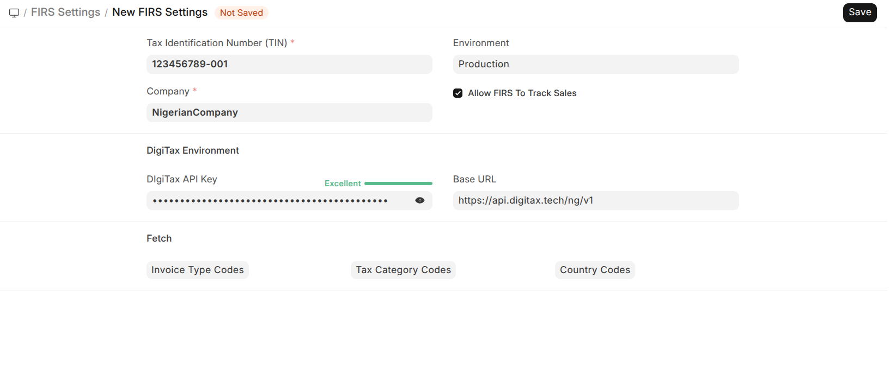
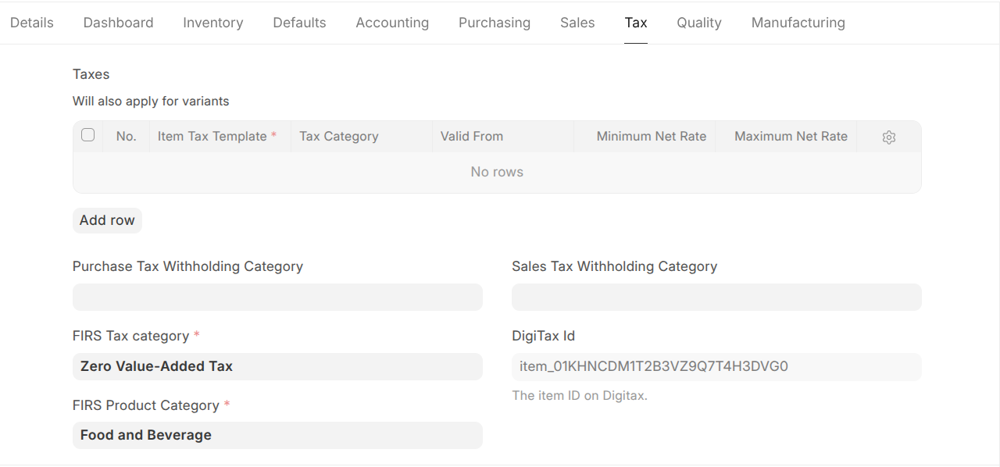

# Nigeria Compliance Via Digitax

Federal Inland Revenue Service (FIRS) integration via Digitax by Navari Ltd for Nigeria.

## Features

### Automatic Data Loading on Installation

When the app is installed, it automatically loads:

- **HS Codes** for Items from [hs-codes.json](https://raw.githubusercontent.com/namiri-tech/docs-rdme-ng/refs/heads/v1.0/assets/hs-codes.json)
- **Service Codes** from [service-codes.csv](https://raw.githubusercontent.com/namiri-tech/docs-rdme-ng/refs/heads/v1.0/assets/service-codes.csv)
- **Tax Categories** from [DigiTax API](https://api.digitax.tech/ng/v1/resources/tax-categories)

These codes are required for DigiTax integration to generate unique item IDs for tax compliance.

## Setup

To set up the app, you need to configure the following settings in your Frappe site:

1. **FIRS Settings**: This is where you will enter your DigiTax API credentials and other related configurations.
2. **Customer Details**: This is where you will enter the details of your customers that are required for tax compliance.
3. **Item Details**: This is where you will enter the details of your items that are required for tax compliance.

### 1. FIRS Settings



In the FIRS Settings, you need to enter the following information:

- **DigiTax API Key**: This is the API key provided by DigiTax for authentication.
- **DigiTax API URL**: This is the base URL for the DigiTax API. The default value is `https://api.digitax.tech/ng/v1`.
- **Enable DigiTax Integration**: This checkbox enables or disables the integration with DigiTax. When enabled, the app will automatically send tax-related data to DigiTax for compliance.
- **Environment**: This field allows you to name the environment (e.g., Production, Staging) for better identification when managing multiple environments.

If the correct API Key is entered, the app will automatically fetch and populate the Tax Categories, Invoice Type Codes and FIRS Country Codes from DigiTax, which will be used when creating or updating items for tax compliance.

To refetch any of the codes, click the relevant button(s).

### 2. Customer Details

If a customer has a **Tax Identification Number (TIN) and an address**:

1. Create a new Customer.


1. In the `Address & Contact` tab, click on `Add Address` and fill in the address details and save. You should have something similar to the screenshot below after saving the address.


1. In the `Tax` tab, add the TIN number as Tax ID, save the document, and a DigiTax ID will be generated for the customer.


- The `is active` checkbox indicates whether the customer identified by the Tax ID is active on the DigiTax system or not.

1. In the `Tax` tab, link the item to the relevant FIRS Tax Category and FIRS Product category. After saving the document, a DigiTax ID will be automatically generated.



### 3. Item Details

1. After creating a new item. On the `Inventory` tab of the item, check the `Allow FIRS Tracking` check field.


## Installation

You can install this app using the [bench](https://github.com/frappe/bench) CLI:

```bash
cd $PATH_TO_YOUR_BENCH
bench get-app $URL_OF_THIS_REPO --branch version-16
bench install-app nigeria_compliance_via_digitax
```

## Contributing

This app uses `pre-commit` for code formatting and linting. Please [install pre-commit](https://pre-commit.com/#installation) and enable it for this repository:

```bash
cd apps/nigeria_compliance_via_digitax
pre-commit install
```

Pre-commit is configured to use the following tools for checking and formatting your code:

- ruff
- eslint
- prettier
- pyupgrade

## CI

This app can use GitHub Actions for CI. The following workflows are configured:

- CI: Installs this app and runs unit tests on every push to `develop` branch.
- Linters: Runs [Frappe Semgrep Rules](https://github.com/frappe/semgrep-rules) and [pip-audit](https://pypi.org/project/pip-audit/) on every pull request.

## License

MIT
